# Authentication Architecture Review

This document reviews the refactored login flow, detailing the data propagation between Client Components, Server Actions, and existing Middleware integration.

## 1. System Overview

The system uses a **Hybrid Architecture**:
- **Authentication**: performed via **Server Actions** for security and direct cookie manipulation.
- **Navigation**: controlled by **Client Components** (`useAuth`, `router`) to respect application state (like `callbackUrl`) and existing Context providers.
- **Validation**: uses shared **Zod Schemas** (`lib/schemas/auth.ts`) on both client and server.

## 2. Data Flow Diagram

```mermaid
sequenceDiagram
    participant User
    participant Client as Client (LoginForm)
    participant Server as Server Action (signin/actions)
    participant Middleware as Middleware/Next.js
    participant DB as Database/Auth API

    User->>Client: Enters Credentials
    Client->>Client: Validate Input (Zod)
    
    rect rgb(20, 20, 20)
    note right of Client: React 19 useActionState
    Client->>Server: Submit FormData
    end
    
    Server->>Server: Validate Input (Zod)
    Server->>DB: Verify Credentials
    
    alt Invalid Credentials
        Server-->>Client: Return { success: false, error: "Invalid..." }
        Client->>User: Show Error Message
    else Valid Credentials
        Server->>Middleware: Set 'auth_token' Cookie (HttpOnly)
        
        par Non-Blocking (Next.js 16)
            Server->>Server: after() -> Log Analytics
        and Response
            Server-->>Client: Return { success: true }
        end
        
        note right of Client: Client Logic
        Client->>Client: useEffect detect success/user
        Client->>Client: router.push(callbackUrl)
    end
```



## 3. Component Analysis

### A. Server Entry (`app/(auth)/signin/page.tsx`)
- **Role**: Pure Server Component.
- **Logic**: minimal. It delegates rendering to `LoginForm`.
- **Review**: **Clean**. Previously had logic to check cookies/redirect, but this was correctly removed to let Middleware and Client Context handle redirects, avoiding race conditions or conflicting logic.

### B. Client Logic (`components/auth/login-form.tsx`)
- **Role**: Interactive Form.
- **Key Features**:
  - Uses `useActionState`: Adopts React 19's primitive for form submission.
  - Uses `useAuth`: Integrates with your existing specific Application Context.
  - **Redirect Strategy**: `useEffect` listens for `state.success` OR `user` presence. This provides a "belt and suspenders" approach—if the server action succeeds, we redirect. If the context updates first, we redirect.
- **Review**: **Robust**. It correctly prioritizes `callbackUrl` for better UX.

### C. Server Logic (`app/(auth)/signin/actions.ts`)
- **Role**: Secure Mutation.
- **Key Features**:
  - **Cookie Name**: `auth_token`. Aligned with `middleware.ts`.
  - **Response**: Returns data (`ActionState`), DOES NOT `redirect()`. This allows the client to handle the transition smoothly.
  - **Background Work**: Uses `after()` for logging without slowing down the response.
- **Review**: **Secure & Efficient**. Logic is separated from presentation.

## 4. Assessment

The implementation is **STABLE** and **CORRECT** based on your requirements:
1.  **Duplicate logic removed**: No double redirects.
2.  **Modern Stack**: Uses Next.js 16/React 19 features effectively.
3.  **Integration**: Matches your existing `middleware` and `AuthContext` patterns.

### Recommendation
The current code in `actions.ts` contains a TODO:
```typescript
// TODOs: Replace this with real DB call
const isAuthenticated = identifier === "admin" && password === "password";
```
You should connect this to your actual backend (e.g. `api/v1/auth/login`) before deploying.

## 5. ACID Compliance

As of v2.0, the auth flow implements ACID-like properties using a Zustand-based lock mechanism:

### Architecture

```
┌─────────────────────────────────────────────────────────────┐
│  User clicks Login/Signup                                    │
└─────────────────────────────────────────────────────────────┘
         │
         ▼
┌─────────────────────────────────────────────────────────────┐
│  Layer 1 (UI Pre-Check): SocialLoginButtons                 │
│  • isAuthLocked() → Show "Please wait" if locked            │
└─────────────────────────────────────────────────────────────┘
         │
         ▼
┌─────────────────────────────────────────────────────────────┐
│  Layer 2 (Context Lock): AuthContext                         │
│  • acquireLock("login-wallet") at start                     │
│  • releaseLock() in finally block                           │
└─────────────────────────────────────────────────────────────┘
         │
         ▼
┌─────────────────────────────────────────────────────────────┐
│  Execute Auth: loginWithWallet/loginWithEmail/etc            │
└─────────────────────────────────────────────────────────────┘
```

### ACID Properties

| Property | Implementation |
|----------|----------------|
| **Atomicity** | Lock acquired at start, released in `finally` block |
| **Consistency** | Single source of truth via `stores/authStore.ts` |
| **Isolation** | Only one auth operation per browser tab |
| **Durability** | HttpOnly cookies (unchanged) |

### Files Modified

| File | Purpose |
|------|---------|
| `stores/authStore.ts` | Zustand store for auth lock management |
| `contexts/AuthContext.tsx` | All auth methods wrapped with lock |
| `components/SocialLoginButtons.tsx` | Early UI lock check |

