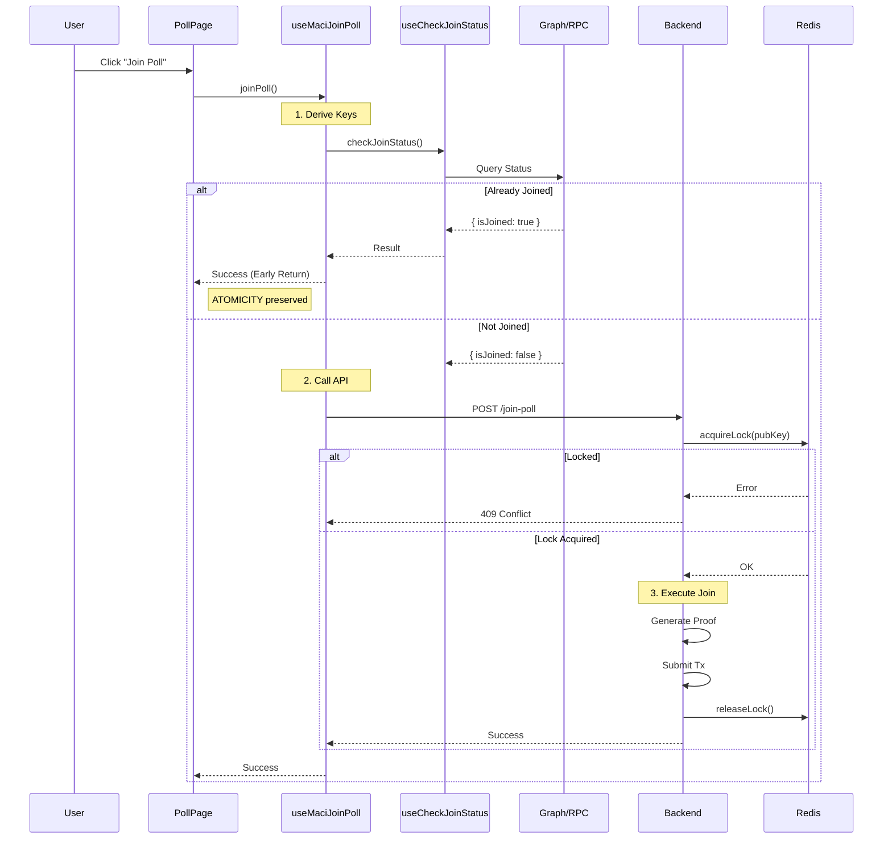

# MACI Join Poll Flow v2.0

> ACID-compliant, thread-safe poll joining with layered consistency checks

## Overview

This document describes the improved **Join Poll** flow that implements full ACID compliance:

1.  **Atomicity** - Early returns prevent partial execution/wasted ZK proofs
2.  **Consistency** - Graph-first checks with RPC fallback ensure current state is known
3.  **Isolation** - Distributed backend locks (`withJoinPollLock`) prevent race conditions
4.  **Durability** - Blockchain guarantees fully preserved

---

## Architecture

```
┌─────────────────────────────────────────────────────────────────┐
│  User clicks "Join Poll"                                        │
└─────────────────────────────────────────────────────────────────┘
         │
         ▼
┌─────────────────────────────────────────────────────────────────┐
│  Layer 1 (Frontend Pre-Check): useCheckJoinStatus()             │
│  • Check Subgraph (Fast) → Found? Return "Already Joined"       │
│  • Check RPC (Fallback) → Found? Return "Already Joined"        │
└─────────────────────────────────────────────────────────────────┘
         │
         ▼ (If not joined)
┌─────────────────────────────────────────────────────────────────┐
│  Layer 2 (Zustand Mutex): acquireLock('join')                   │
│  • Prevents double-clicks/concurrent joins locally              │
└─────────────────────────────────────────────────────────────────┘
         │
         ▼
┌─────────────────────────────────────────────────────────────────┐
│  Layer 3 (Backend Lock): withJoinPollLock(pubKey)               │
│  • Redis-based distributed lock on public key                   │
│  • Ensures Isolation across all API instances                   │
└─────────────────────────────────────────────────────────────────┘
         │
         ▼
┌─────────────────────────────────────────────────────────────────┐
│  Execute Join: maciApi.joinPoll()                               │
│  • Generate ZK Proof                                            │
│  • Submit transaction                                           │
└─────────────────────────────────────────────────────────────────┘
```

---

## Key Components

### 1. Frontend Pre-Check (`hooks/useMaciJoinPoll.ts`)

Before generating expensive ZK proofs or calling the API, we verify the user's status:

```typescript
// hooks/useMaciJoinPoll.ts
const { checkJoinStatus } = useCheckJoinStatus();

// ... inside handleJoinPoll ...

// 1. Derive keys
const { privateKey, pubKeyX, pubKeyY } = await deriveMaciKeypair(...);

// 2. Pre-check status (ACID: Consistency)
const joinResult = await checkJoinStatus(pollId, pubKeyX, pubKeyY, maciAddress, publicClient);

if (joinResult.isJoined) {
  return { success: true, alreadyJoined: true, ... };
}

// 3. Proceed to API only if not joined
```

### 2. RPC Fallback (`hooks/useCheckJoinStatus.ts`)

We check the Graph first for speed, but fall back to direct chain events (`PollJoined`) if the Graph is behind or unavailable:

```typescript
// hooks/useCheckJoinStatus.ts

// 1. Try Subgraph
const subgraphResult = await checkFromSubgraph(pubKeyX, pubKeyY, pollId);
if (subgraphResult.isJoined) return subgraphResult;

// 2. Fallback to RPC (ACID: Consistency)
if (shouldTryRpc) {
  // Scans 'PollJoined' events on the Poll contract
  const chainResult = await checkFromChain(pubKeyX, pubKeyY, pollId, maciAddress, publicClient);
  if (chainResult.isJoined) return chainResult;
}
```

### 3. Backend Distributed Lock (`maci.service.ts`)

To ensure **Isolation**, we wrap the backend operation in a distributed lock keyed by the user's public key:

```typescript
// api/maci.service.ts

// Derive pubKey from privateKey for lock key
const { pubKeyX, pubKeyY } = derivePubKey(maciPrivateKey);

return this.smartNonceService.withJoinPollLock(pollId, pubKeyX, pubKeyY, async () => {
  // Critical section: join poll
  // ...
});
```

---

## Flow Diagram



---

## Error Handling

| Error | Cause | Solution |
|-------|-------|----------|
| **"JoinPoll already in progress"** | Duplicate request caught by backend lock | Wait for first request to complete |
| **"User already joined"** | Caught by Contract/Backend if frontend check missed it | Handled gracefully, returns success state |
| **"Poll does not exist"** | Invalid Poll ID | Frontend validates Poll ID before call |

---

## Files Modified

| File | Purpose |
|------|---------|
| `hooks/useMaciJoinPoll.ts` | Added pre-checks and logical early return |
| `hooks/useCheckJoinStatus.ts` | Added RPC event scanning fallback |
| `api/maci.service.ts` | Added `withJoinPollLock` wrapper |

---

## Related Documentation

- [MACI Signup V2](./MACI_SIGNUP_V2.md) - Similar flow for initial signup
