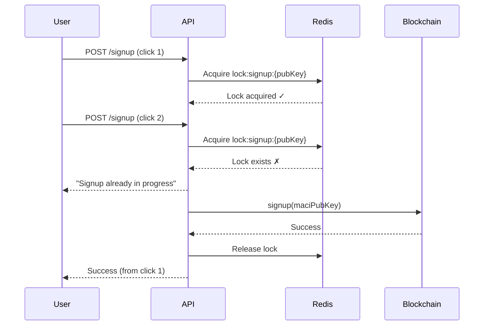

# Tổng Hợp Refactor Hệ Thống Quản Lý Khóa MACI

> **Ngày:** 21/12/2024  
> **Branch:** dev/signup

---

## 1. File Mới: `apps/web/utils/maciKeyDerivation.ts`

Tạo mới file chứa logic tạo khóa MACI:

```typescript
// Các hàm chính:
deriveMaciKeypair()     // Tạo keypair từ chữ ký EIP-712
clearMaciKeyCache()     // Xóa cache khi logout
hasCachedMaciKeypair()  // Check có cache chưa
getCachedMaciKeypair()  // Lấy keypair từ cache
getStateIndexFromChain() // Query stateIndex từ blockchain
```

---

## 2. Backend: `apps/api/src/modules/maci/maci.service.ts`

### Thêm Import
```typescript
import { PubKey } from '@maci-protocol/domainobjs';
```

### Thêm Error Handling cho "Đã Đăng Ký"
```typescript
// Trong hàm signup(), catch block:
const isAlreadySignedUp =
  errMsg.includes("0xf45d43bf") || // UserAlreadyJoined
  errMsg.includes("0x258a195a");   // LeafAlreadyExists

if (isAlreadySignedUp) {
  // Query stateIndex từ chain thay vì throw 500
  const pubKey = PubKey.deserialize(maciPubKey);
  const publicKeyHash = await maciContract.hash2([pubKeyX, pubKeyY]);
  const stateIndex = await maciContract.getStateIndex(publicKeyHash);
  
  return {
    success: true,
    stateIndex: stateIndex.toString(),
    alreadySignedUp: true
  };
}
```

---

## 3. Backend: `apps/api/src/modules/polls/schemas/polls.ts`

### Thêm Field
```typescript
@Prop({ required: false })
maciAddress: string;  // MACI contract address this poll belongs to
```

---

## 4. Backend: `apps/api/src/modules/polls/polls.controller.ts`

### Thêm vào UpdateChainDto
```typescript
class UpdateChainDto {
  @ApiProperty()
  pollIdOnChain: number;

  @ApiProperty({ required: false })
  subgraphUrl?: string;

  @ApiProperty({ required: false })
  maciAddress?: string;  // MỚI
}
```

---

## 5. Backend: `apps/api/src/modules/polls/polls.service.ts`

### Cập Nhật savePollOnChainId
```typescript
async savePollOnChainId(
  pollId: string,
  pollIdOnChain: number,
  subgraphUrl?: string,
  maciAddress?: string,  // THÊM PARAM MỚI
) {
  const update: any = { pollIdOnChain };
  if (subgraphUrl) update.subgraphUrl = subgraphUrl;
  if (maciAddress) update.maciAddress = maciAddress;  // THÊM
  // ...
}
```

---

## 6. Frontend: `apps/web/hooks/useMaciSignup.ts`

### Xóa localStorage Writes
```diff
- localStorage.setItem("maci_priv_key", privateKey);
- localStorage.setItem("maci_pub_key", publicKey);
- localStorage.setItem("maci_state_index", stateIndex);
```

### Thêm Xử Lý "Đã Đăng Ký"
```typescript
} catch (apiErr: any) {
  const isAlreadySignedUp = 
    errMsg.toLowerCase().includes("already") ||
    errMsg.toLowerCase().includes("signed up");
  
  if (isAlreadySignedUp) {
    return {
      success: true,
      stateIndex: null,
      alreadySignedUp: true,
    };
  }
  throw apiErr;
}
```

---

## 7. Frontend: `apps/web/hooks/useMaciVote.ts`

### Thay Đổi
```diff
- const privateKey = localStorage.getItem("maci_priv_key");
- const publicKey = localStorage.getItem("maci_pub_key");
- const stateIndex = localStorage.getItem("maci_poll_state_index");

+ const { privateKey, publicKey, pubKeyX, pubKeyY } = await deriveMaciKeypair(
+   address, chainId, signTypedDataAsync, { maciAddress }
+ );
+ const { stateIndex } = await getStateIndexFromChain(...);
```

---

## 8. Frontend: `apps/web/hooks/useMaciJoinPoll.ts`

### Thay Đổi
```diff
- const privateKey = localStorage.getItem("maci_priv_key");

+ const { privateKey } = await deriveMaciKeypair(
+   address, chainId, signTypedDataAsync, { maciAddress }
+ );
```

---

## 9. Frontend: `apps/web/hooks/useMACI.ts`

### Thêm Optional maciAddress Param
```typescript
const signupToMaci = async (
  pubKeyX?: string, 
  pubKeyY?: string, 
  maciAddressOverride?: string  // MỚI
) => {
  const maciAddress = maciAddressOverride || getMaciAddress();
  // ...
};

const joinMaciPoll = async (
  pollId: string,
  startBlock: number | undefined,
  privKey: string,
  signupBlockNumber?: number,
  maciAddressOverride?: string  // MỚI
) => { ... };

const submitVote = async (
  pollId: string,
  voteOptionIndex: number,
  voteWeight: number,
  nonce: number = 1,
  startBlock?: number,
  maciAddressOverride?: string  // MỚI
) => { ... };
```

---

## 10. Frontend: `apps/web/app/polls/[id]/components/interactive/signup-modal.tsx`

### Xóa localStorage
```diff
- localStorage.setItem(`maci_poll_state_index_${pollIdOnChain}`, joinResult.pollStateIndex);
- localStorage.setItem("maci_poll_state_index", joinResult.pollStateIndex);
- localStorage.setItem(`maci_voice_credits_${pollIdOnChain}`, joinResult.voiceCredits);
- localStorage.setItem("maci_voice_credits", joinResult.voiceCredits);

+ // Note: No localStorage needed - useMaciVote now gets stateIndex from chain
```

### Thay Đổi Check Cache
```diff
- const hasExistingKey = localStorage.getItem("maci_priv_key");

+ const hasExistingKey = hasCachedMaciKeypair(address, chainId);
```

---

## 11. Frontend: `apps/web/contexts/AuthContext.tsx`

### Thêm Clear Cache Khi Logout
```typescript
import { clearMaciKeyCache } from "@/utils/maciKeyDerivation";

const signout = async () => {
  // ... existing logout logic
  clearMaciKeyCache();  // THÊM
};
```

---

## 12. Frontend: `apps/web/lib/polls/service.ts`

### Thêm maciAddress vào Types
```typescript
export type PollData = {
  id: string;
  onChainId: string;
  // ... existing fields
  maciAddress?: string;  // MỚI
};

type ApiPoll = {
  // ... existing fields
  maciAddress?: string;  // MỚI
};
```

### Thêm Mapping
```typescript
return {
  // ... existing mappings
  maciAddress: source.maciAddress,  // MỚI
};
```

---

## Package Đã Cài

```bash
# Trong apps/api
pnpm add @maci-protocol/domainobjs
```

---

## 13. JoinPoll & Vote: Xóa localStorage Hoàn Toàn

### Vấn đề
Các file còn dùng localStorage để lưu `maciAddress`, `maciStartBlock`.

### Giải pháp

#### A. Backend: Thêm API Endpoints

**File:** `apps/api/src/modules/maci/maci.controller.ts`

```typescript
// GET /maci/deployments/latest
@Get('deployments/latest')
async getLatestDeployment() {
  const deployment = await this.maciDeploymentsService.getLatest();
  return {
    maciAddress: deployment.maciAddress,
    startBlock: deployment.startBlock,
    subgraphUrl: deployment.subgraphUrl,
    chain: deployment.chain,
  };
}

// GET /maci/deployments/:address
@Get('deployments/:address')
async getDeploymentByAddress(@Param('address') address: string) {
  const deployment = await this.maciDeploymentsService.getByAddress(address);
  return {...};
}
```

#### B. Frontend: Thêm API Methods

**File:** `apps/web/api/maci.api.ts`

```typescript
getLatestDeployment: async () => {
  const response = await api.get("/maci/deployments/latest");
  return response.data;
},

getDeploymentByAddress: async (maciAddress: string) => {
  const response = await api.get(`/maci/deployments/${maciAddress}`);
  return response.data;
},
```

#### C. useMaciJoinPoll.ts - Thay localStorage

```diff
- // Fallback to localStorage
- if (!effectiveStartBlock && typeof window !== "undefined") {
-   const maciStartBlockStr = localStorage.getItem("maciStartBlock");
-   if (maciStartBlockStr) {
-     effectiveStartBlock = parseInt(maciStartBlockStr);
-   }
- }

+ // Fetch from API
+ if (!effectiveStartBlock) {
+   const deployment = await maciApi.getLatestDeployment();
+   effectiveStartBlock = deployment.startBlock || 0;
+ }
```

#### D. votes/[id]/page.tsx - Thay localStorage

**DebugPanel useEffect:**
```diff
- localStorage.getItem("maciAddress")
- localStorage.getItem("maci_poll_state_index")

+ const deployment = await maciApi.getLatestDeployment();
+ setMaciAddress(deployment.maciAddress);
+ setStartBlock(deployment.startBlock);
```

**Tally flow:**
```diff
- const storedMaciAddress = localStorage.getItem("maciAddress");
- const startBlock = Number(localStorage.getItem("maciStartBlock") || "0");

+ const storedMaciAddress = maciAddress;  // from state
+ const storedStartBlock = startBlock;    // from state
```

**handleVote:**
```diff
- const storedBlock = localStorage.getItem("maciStartBlock");
- const startBlock = storedBlock ? Number(storedBlock) : undefined;

+ const deployment = await maciApi.getLatestDeployment();
+ const votingStartBlock = deployment.startBlock;
```

### Kết quả: Không còn localStorage

| File | Status |
|------|--------|
| `useMaciJoinPoll.ts` | ✅ Clean |
| `useMaciVote.ts` | ✅ Clean |
| `useMACI.ts` | ✅ Clean |
| `signup-modal.tsx` | ✅ Clean |
| `votes/[id]/page.tsx` | ✅ Clean |

---

## 14. JoinPoll: "Already Joined" Error Handling

### Backend: `apps/api/src/modules/maci/maci.service.ts`

```typescript
// Trong catch block của joinPoll()
const isAlreadyJoined = 
  decodedError === 'UserAlreadyJoined' ||
  errorMessage.toLowerCase().includes('already joined') ||
  errorMessage.toLowerCase().includes('user has already joined');
  
if (isAlreadyJoined) {
  this.logger.log("User already joined poll. Treating as success.");
  return {
    success: true,
    alreadyJoined: true,
    pollStateIndex: "0",
    voiceCredits: "0",
  };
}
```

---

## 15. JoinPoll: Double-click Prevention

### File: `apps/web/hooks/useMaciJoinPoll.ts`

```typescript
const [isProcessing, setIsProcessing] = useState(false);

const handleJoinPoll = async (...) => {
  if (isProcessing || loading) {
    console.log("JoinPoll already in progress, skipping...");
    return { success: false, error: "Join already in progress" };
  }
  
  setIsProcessing(true);
  // ... rest of logic
  
  } finally {
    setLoading(false);
    setIsProcessing(false);
  }
};
```

---

## 16. Vote: Tối ưu getStateIndexFromChain

### Vấn đề
Scan event logs rất chậm (~triệu blocks).

### Giải pháp
Gọi trực tiếp MACI contract.

### File: `apps/web/utils/maciKeyDerivation.ts`

```diff
- // OLD: Scan events (SLOW)
- const logs = await publicClient.getLogs({...});

+ // NEW: Direct contract call (FAST)
+ const publicKeyHash = await publicClient.readContract({
+   address: maciAddress,
+   abi: MACI_ABI,
+   functionName: "hash2",
+   args: [[BigInt(pubKeyX), BigInt(pubKeyY)]],
+ });
+
+ const stateIndex = await publicClient.readContract({
+   address: maciAddress,
+   abi: MACI_ABI,
+   functionName: "getStateIndex",
+   args: [publicKeyHash],
+ });
```

---

## 17. Redlock Distributed Locking cho Signup

### Vấn đề
User có thể click signup nhiều lần gây duplicate requests.

### Giải pháp
Sử dụng Redlock để prevent race conditions.

### SmartNonceService (`smart-nonce.service.ts`)

```typescript
/**
 * Lock signup theo pubKey để ngăn duplicate signup
 * - Lock key: lock:signup:{maciAddress}:{pubKeyHash}
 * - Nếu lock fail → "Signup already in progress..."
 */
async withSignupLock<T>(
  maciAddress: string,
  pubKeyX: string,
  pubKeyY: string,
  fn: () => Promise<T>
): Promise<T> {
  const pubKeyHash = `${pubKeyX.slice(0, 10)}_${pubKeyY.slice(0, 10)}`;
  const lockKey = `lock:signup:${maciAddress.toLowerCase()}:${pubKeyHash}`;
  
  let lock = await this.redlock.acquire([lockKey], this.LOCK_TTL);
  try {
    return await fn();
  } finally {
    await lock.release();
  }
}

/**
 * Lock joinPoll theo pubKey + pollId
 */
async withJoinPollLock<T>(
  pollId: string,
  pubKeyX: string,
  pubKeyY: string,
  fn: () => Promise<T>
): Promise<T> { ... }
```

### MaciService (`maci.service.ts`)

```diff
  async signup(maciPubKey: string, maciAddress?: string, sgData?: string) {
+   // Use Redlock to prevent duplicate signup requests
+   const pubKeyForLock = maciPubKey.slice(0, 20);
+   
+   return this.smartNonceService.withSignupLock(
+     address,
+     pubKeyForLock,
+     pubKeyForLock,
+     async () => {
        // ... original signup logic
+     }
+   );
  }
```

### Flow



