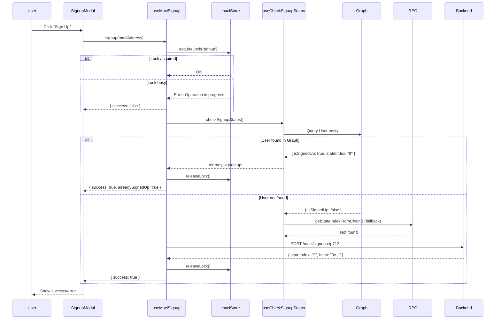

# MACI Signup Flow v2.0

> Thread-safe, Graph-first MACI signup with hybrid concurrency control

## Overview

This document describes the improved MACI signup flow that implements:

1. **Thread Safety** - Zustand-based client mutex prevents race conditions
2. **Graph-first Checks** - Query subgraph before RPC for performance
3. **Dynamic Config** - Subgraph URL fetched from database, not env vars
4. **Layered Defense** - Multiple validation layers for robustness

---

## Architecture

```
┌─────────────────────────────────────────────────────────────────┐
│  User clicks "Sign Up to MACI"                                  │
├─────────────────────────────────────────────────────────────────┤
│  Layer 1 (Zustand): acquireLock('signup') → Prevent double-click│
├─────────────────────────────────────────────────────────────────┤
│  Layer 2 (Graph): checkSignupStatus() via API → Already signed? │
│     ├─ YES → Return success, skip transaction                  │
│     └─ NO  → Continue to signup                                │
├─────────────────────────────────────────────────────────────────┤
│  Layer 3 (RPC Fallback): getStateIndexFromChain() if Graph fails│
├─────────────────────────────────────────────────────────────────┤
│  Layer 4 (Deterministic Key): deriveMaciKeypair() → Same key    │
├─────────────────────────────────────────────────────────────────┤
│  Submit to Backend → releaseLock()                              │
└─────────────────────────────────────────────────────────────────┘
```

---

## Key Components

### 1. Zustand Store (`stores/maciStore.ts`)

Client-side state management with mutex and keypair caching:

```typescript
import { useMaciStore, useWithMaciLock } from "@/stores/maciStore";

// Get store methods
const { setKeypair, getKeypair, hasKeypair } = useMaciStore();
const { withLock, isLocked } = useWithMaciLock();

// Wrap operation with lock
await withLock('signup', walletAddress, undefined, async () => {
  // Only one signup can run at a time
  return await performSignup();
});
```

### 2. Graph Signup Check (`hooks/useCheckJoinStatus.ts`)

Check if user already signed up via Graph (fast) or RPC (fallback):

```typescript
import { useCheckSignupStatus } from "@/hooks/useCheckJoinStatus";

const { checkSignupStatus } = useCheckSignupStatus();

// Check before signup
const result = await checkSignupStatus(pubKeyX, pubKeyY, maciAddress, publicClient);
if (result.isSignedUp) {
  console.log('Already signed up! StateIndex:', result.stateIndex);
  return; // Skip signup
}
```

### 3. Dynamic Subgraph URL (`api/maci.api.ts`)

Subgraph URL fetched from database (like `SmartNonceService`):

```typescript
import { maciApi } from "@/api/maci.api";

// Get MACI config including subgraph URL
const config = await maciApi.getConfig();
// → { maciAddress: "0x...", subgraphUrl: "https://...", startBlock: 12345 }
```

### 4. Signup Hook (`hooks/useMaciSignup.ts`)

Complete signup flow with all safety layers:

```typescript
import { useMaciSignup } from "@/hooks/useMaciSignup";

const { signup, loading, error, isLocked } = useMaciSignup();

// Signup to MACI
const result = await signup(maciAddress);
if (result.success) {
  console.log('Signed up! StateIndex:', result.stateIndex);
}
```

---

## API Endpoints

### GET `/maci/config`

Returns MACI configuration from database:

```json
{
  "maciAddress": "0x1234...",
  "subgraphUrl": "https://api.thegraph.com/...",
  "startBlock": 224688901
}
```

### POST `/maci/signup-eip712`

Secure signup with EIP-712 signature:

```json
{
  "pubKeyX": "12345...",
  "pubKeyY": "67890...",
  "signature": "0x...",
  "nonce": 0,
  "deadline": 1703289600,
  "maciAddress": "0x..."
}
```

---

## Subgraph Queries

### Check Signup Status (User Entity)

```graphql
query CheckMaciSignup($userId: ID!) {
  user(id: $userId) {
    id
    createdAt
    accounts {
      id                    # This is the stateIndex
      voiceCreditBalance
    }
  }
}
```

Where `$userId = "pubKeyX pubKeyY"` (space-separated).

### Check Poll Join Status (Registration Entity)

```graphql
query CheckRegistration($id: ID!) {
  registrations(where: { id: $id }) {
    id                      # Format: "pollId-userId"
    poll { pollId }
    user { id }
    createdAt
  }
}
```

---

## Flow Diagram



---

## Error Handling

| Error | Cause | Solution |
|-------|-------|----------|
| "Another MACI operation is in progress" | Lock not acquired | Wait for current operation |
| "No subgraph URL configured" | API returned null | Check MaciDeployments in database |
| "User not signed up" | No stateIndex found | Proceed with normal signup |
| "Invalid stateIndex format" | Public key passed instead of number | Fix caller to pass numeric stateIndex |

---

## Console Logs

Watch for these logs in browser DevTools:

```
📡 [getSubgraphUrl] Fetching from API...
📡 [getSubgraphUrl] Got from API: https://...
🔍 [checkSignupStatus] Starting check...
📊 [checkSignupStatus] Querying Graph...
📊 [checkSignupStatus] Graph result: isSignedUp=false, source=subgraph
⛓️ [checkSignupStatus] Falling back to RPC chain query...
✅ [checkSignupStatus] Found on-chain: stateIndex=9
```

---

## Migration Notes

### From v1.0 (Old Flow)

**Before:**
```typescript
// Direct RPC check, no Graph
const { stateIndex } = await getStateIndexFromChain(...);
```

**After:**
```typescript
// Graph-first, RPC fallback
const { checkSignupStatus } = useCheckSignupStatus();
const result = await checkSignupStatus(pubKeyX, pubKeyY, maciAddress, publicClient);
```

### Breaking Changes

1. `getSubgraphUrl()` is now **async** - must use `await`
2. `useCheckJoinStatus` returns additional `useCheckSignupStatus` hook
3. Zustand store required for `useMaciSignup` and `useMaciJoinPoll`

---

## Files Modified

| File | Changes |
|------|---------|
| `stores/maciStore.ts` | **NEW** - Zustand store with mutex |
| `hooks/useCheckJoinStatus.ts` | Added Graph queries, dynamic URL |
| `hooks/useMaciSignup.ts` | Integrated store and Graph check |
| `hooks/useMaciJoinPoll.ts` | Integrated store |
| `api/maci.api.ts` | Added `getConfig()` |
| `maci.controller.ts` | Added `GET /maci/config` |
| `maci.service.ts` | Added `getConfig()` |

---

## Related Files

- [maciStore.ts](../apps/web/stores/maciStore.ts) - Zustand store
- [useCheckJoinStatus.ts](../apps/web/hooks/useCheckJoinStatus.ts) - Graph checks
- [useMaciSignup.ts](../apps/web/hooks/useMaciSignup.ts) - Signup hook
- [smart-nonce.service.ts](../apps/api/src/modules/maci/smart-nonce.service.ts) - Backend nonce management
